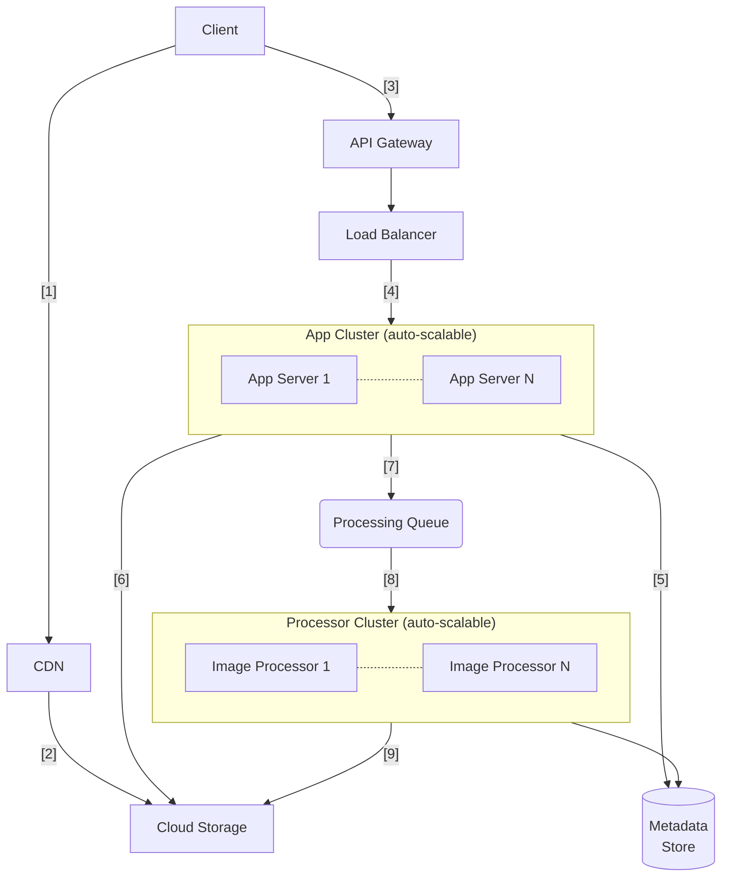

# Image Service Design

## Problem

How would you implement an image upload and hosting service?
This service should allows it's clients to upload images, do some image processing to optimize the resolution/quality and potentially resizing/crop the input. This service should also host the image.

### Requirements

1. Should be able to accept single/bulk image payloads.
2. Work both async and sync.
3. Be able handle >100k images uploads and should be able to host >10M images / day.
4. Allow you to define image processing instructions (crop/resize/watermark) [nice to have].

### How to submit

Create A block level, process flow diagram with short description of how the above requirements are fulfilled.

## Solution Design

_Note: The cloud specific service names are delibrately omitted to focus on the underlying architecture_

1. Client loads web application (SPA) and images through cloud storage via CDN. This approach has some advantages like caching and scalability. The web application has views for:
    - Listing available images
    - View images
    - Upload single and multiple images along with additional information (metadata)
    - Perform in-place, client side operations on a single image.
2. All static assets and images are hosted on the cloud storage.
3. SPA interacts with backend via REST APIs. The use of API Gateway provides security, throttling, caching etc. REST APIs provide relevant interfaces for single and bulk image upload. They also provide image listing and viewing capabilities.
4. The app server is able to scale out and is kept stateless. A load balancer is used ensure that the app cluster is able to perform conistently under load. It ensures this by spawning new application instances or killing them based on traffic.
5. Application server saves image metadata in database (could be SQL or NoSQL). Image metadata is required to efficiently manage image records for searching, listing etc.
6. Application server saves the image in cloud storage (user-level buckets).
7. If a user has requested to perform image processing (cropping, sizing, watermark) in a bulk image upload then processing queue is used to manage the individual requests.
8. Each image processor works on single image. If the load is high, multiple processor as started to work on incoming requests.
9. Processors store the modified image in the designated cloud storage. They also update metadata (e.g. URL) as needed.

### How this design fulfills the requirements

1. Should be able to accept single/bulk image payloads: The use of load-balancer along with separate workflow for image processors enables the system to handle both single and bulk image uploads in an equally efficient manner. The web client can be written in a way to batch and execute bulk requests in parallel.
2. Work both async and sync: Image processing as a bulk operation can become a bottleneck. Asynchronous processing with the introduction of processing queue unblocks the user. The processing cluster can fully scalable via auto-scaling.
3. Be able handle >100k images uploads and should be able to host >10M images / day: The use of cloud storage along with load balancers and auto-scaling application clusters will help store and handle the required amount of images.
4. Allow you to define image processing instructions (crop/resize/watermark) [nice to have]: A dedicated image processing cluster helps in performing the required edits on each image. The processors will use specialized libraries depending on the selected tech stack.
